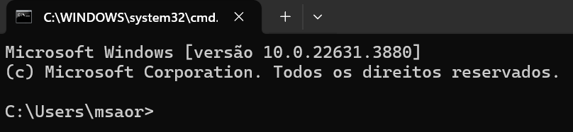

# Relatório de Estudos

**Nome do Estagiário:** Melina Nogueira  
**Data:** 06/08/2024

## **Índice**  
1. **[Terminal](#terminal)**

    1.1.[Comandos Básicos](#comandos-básicos)

2. **[Dataform](#dataform)**

    2.1. [Transformação de dados](#transformação-de-dados)

    2.2. [Repositório](#repositório)

    2.3. [Vantagens](#vantagens)

3. **[Payload](#payload)**

4. **[JSON](#json-javascript-object-notation)**

    4.1. [Estrutura](#estrutura)
    
    4.2. [Arquivos](#arquivos)
---

## Terminal
Utilizamos o terminal para fazer instalações, configurações, checar dados e navegar pelo sistema de arquivos.

Temos dois tipos de terminal:
- CMD/ Prompt de comando;
- PowerShell, ele é uma evolução do CMD, capaz de utilizar comandos baseados no Unix(Linux e MacOS).

**Tela inicial**


O "C:\Users\msaor" indica para que pasta ele está apontando, no caso ele está acessando o disco C (HD ou SSD), a pasta users e o usuario msaor.

### Comandos Básicos

`dir` lista para o usuário as pastas ou arquivos que estão no caminho apontado pelo terminal;

`cd` acessa uma pasta, como se fosse um double click;

`cd ..` volta para a pasta anterior;

`cls / clear` limpa o prompt de comando;

`mkdir` cria uma pasta;

`del` deleta uma pasta;

`ctrl c` para de executar um comando.

## Dataform
Ferramenta de gerenciamento e manipulação de dados em SQL. 
Ele permite construir pipelines, criar transformações de dados usando o processo ELT e reutilizar códigos.

### Transformação de dados
- Criar repositório para trabalhar com controle de versão;
- Criar espaços de trabalho, para poder realizar alterações no repositório, compilar, testar e enviar para o repositório principal;
- Desenvolver núcleo: definir, documentar tabelas, configurar as dependências e utilizar lógica de transformação para criar o fluxo de trabalho;
- Compilar o núcleo, adicionar instruções, resolver dependências, verificar erros e criar a árvore de dependências;
- Executar árvore de dependências: executar comandos SQL, consultas de declaração, visualizações e outras operações definidas pelo usuário.

### Repositório
Cada projeto do Dataform é armazenado em repositório. O repositório pode armazenar arquivos em JSON, SQLX e JavaScript. 

Estes arquivos podem ser responsáveis pela configuração dos fluxoes de trabalho(JSON ou SQLX), pela definição de novas tabelas e visualizações(SQLX e JavaScript) e definição variáveis e funções (JavaScript).

### Vantagens
- Ferramenta de baixo código, facilitando o uso;
- Fornece recursos para gerenciamento de dados;
- Controle de versão utilizando git;
- Gera automaticamente a documentação para pipelines.

## Payload
Descreve os dados que são transportados em uma mensagem ou requisição entre sistemas, ou seja, ele representa a parte da mensagem que contém os dados reais que se quer transmitir ou processar.

**Exemplo**
``` JSON
{
  "evento": "compra_realizada",
  "id_cliente": 12345,
  "valor_total": 250.75
}
```

## JSON (JavaScript Object Notation)
Formato de dados, utilizado para transmitir informações entre sistemas, além da fácil compreensão por humanos e máquinas.

### Estrutura
- **Objetos**: conjunto de  `chave: valor`, representado por `{}`;
- **Arrays**: lista de valores, representado por `[]`;
- **Valores**:
    - Números: inteiros ou decimais;
    - Strings: representado por `" "`;
    - Boolenaos: representado por `true` ou `false`;
    - Nulo: representado por `null`;
    - Objeto: `chave: valor`.

### Arquivos
- **Manifest.json:** detalha e especifica metadados básicos sobre sua extensão, como nome, versão e permissões;
- **Package.json:** utilizado em projetos, ele gerencia dependências, informações do projeto, scripts de execução e metadados do projeto. 

**Exemplo**
```JSON
{
  "nome": "Melina",
  "idade": 18,
  "profissão": "Engenheira de Software",
  "habilidades": ["Python", "SQL", "Data Science"],
  "endereço": {
    "rua": "Rua das Flores",
    "cidade": "São Paulo",
    "cep": "01234-567"
  },
  "tem_cnh": false
}
```
---

### **Recursos Utilizados:**
- [Você conhece o Dataform?](https://www.atrainformatica.com.br/2024/04/01/voce-conhece-o-dataform/)
- [Visão geral do Dataform](https://cloud.google.com/dataform/docs/overview?hl=pt-br)
- [Iniciando com o Terminal do Windows](https://blog.formacao.dev/iniciando-com-o-terminal-do-windows/)
- [Saiba o que é JSON e como utilizar](https://www.alura.com.br/artigos/o-que-e-json)

---

### **Desafios Encontrados:**  
- 

### **Próximos Passos:**  
- 
---